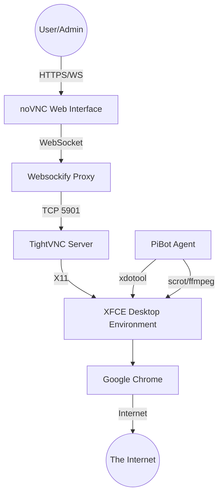

# PiBot Environment Architecture

The PiBot Environment is a dedicated Linux-based stack designed for autonomous agents that require a graphical interface and a web browser.

## Component Diagram

## Technical Stack

| Component | Technology | Role |
| :--- | :--- | :--- |
| **OS** | Ubuntu 24.04 LTS | Stable base, excellent ARM/x86 support. |
| **User** | `pibot` | Dedicated non-root user for security. |
| **Desktop** | XFCE 4 | Extremely lightweight and reliable. |
| **Browser** | Google Chrome | Industry standard for automation. |
| **Remote Access** | VNC + noVNC | Visible, real-time access via browser. |
| **Automation** | xdotool + scrot | Standard tools for screen control/capture. |

## Network Ports

- **6080**: noVNC Web Interface (Main access).
- **5901**: VNC Server (Internal use/VPN).
- **22**: SSH (Administration).
